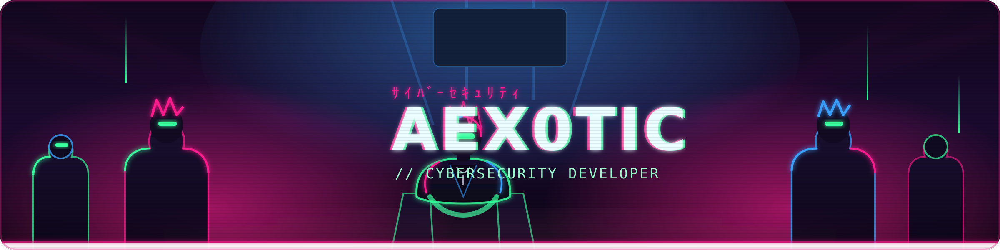

<!-- ═══════════════════════════════════════════════════════════════════ -->
<!--                          ◤ AEX0TIC ◢                               -->
<!--                    Cybersecurity Developer                          -->
<!-- ═══════════════════════════════════════════════════════════════════ -->

<div align="center">
  
</div>

<div align="center">

<a href="https://readme-typing-svg.demolab.com">
  
</a>

<br/>


<br/><br/>

<a href="https://www.linkedin.com/in/pparekh2004/"></a>
<a href="https://aex0tic.github.io/"></a>
<a href="mailto:prkhprt001@gmail.com"></a>
<a href="https://github.com/AEX0TIC"></a>

</div>

## 👾 `system.whoami()`

```rust
let dev = Operator {
    alias:      "AEX0TIC",
    class:      "Cybersecurity Developer",
    education:  "B.Tech CSE (Cybersecurity) · SRM Institute · CGPA 8.67/10",
    focus:      "Secure systems · automation · applied ML · the decentralized web",
    status:     "// online — building, breaking, and shipping",
};
```

<details>
<summary><b>🎌 &nbsp;<code>./cat manifesto.md</code> &nbsp;— tap to decrypt</b></summary>

<br/>

I build where **security meets everything else** — secure systems, threat-detection
automation, applied machine learning, and the decentralized web. I chase problems that are
*actually hard* and ship solutions that *actually work*. Fueled by curiosity, caffeine,
and a healthy disrespect for *"it can't be done."*

</details>

<div align="center">━━━━━━━━━━━━━━━━━━ ✦ ━━━━━━━━━━━━━━━━━━</div>

## ⚡ `load_arsenal.sh`

<div align="center">

**⟨ Languages ⟩**


**⟨ Security · Offensive & Defensive ⟩**


**⟨ AI / Machine Learning ⟩**


**⟨ Web3 · Blockchain ⟩**


**⟨ Cloud · Tooling · Data ⟩**


</div>

<div align="center">━━━━━━━━━━━━━━━━━━ ✦ ━━━━━━━━━━━━━━━━━━</div>

## 🏆 `achievements.log`

<div align="center">

| ⚔️ Rank | 🎯 Arena | 🏷️ Domain |
|:---:|:---|:---:|
| 🥉 **3rd Place** | LAYERS Hackathon | `Security` |
| 🏅 **Top 6** | CME Hackathon | `Cloud / SRE` |
| 📜 **2× Published** | IEEE ICSCSA · ICCET 2026 | `Research` |

</div>

<div align="center">━━━━━━━━━━━━━━━━━━ ✦ ━━━━━━━━━━━━━━━━━━</div>

## 📄 `publications.bib`

> 📄 **Cross-Layer IoT Intrusion Detection** — *IEEE ICSCSA 2026*
> Fusing Cowrie honeypot logs with hardware telemetry on a Raspberry Pi 5; an ensemble of
> XGBoost / Random Forest / LSTM classifiers over a 42-dimensional feature vector detects
> five distinct attack types.

> 📄 **Blockchain-Based Privacy-Preserving Medical Records** — *ICCET 2026*
> A decentralized framework for confidential, tamper-resistant patient record management.

<div align="center">━━━━━━━━━━━━━━━━━━ ✦ ━━━━━━━━━━━━━━━━━━</div>

## 🛡️ `certifications.crt`

<div align="center">


`Security+ — valid 2025–2028` &nbsp;•&nbsp; `Cisco Ethical Hacking — 2025`

</div>

<div align="center">━━━━━━━━━━━━━━━━━━ ✦ ━━━━━━━━━━━━━━━━━━</div>

## 📊 `git streak`

<div align="center">


</div>


